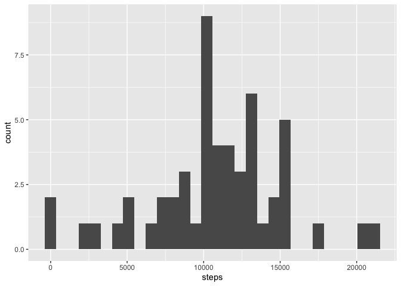
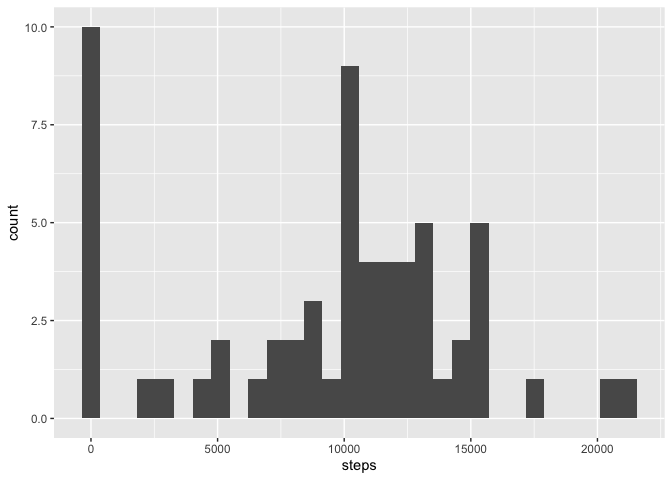

## Loading and preprocessing the data
Read pre-loaded activity date from zip file. Parse second column as `Date` type
to help visualize timeseries.

```r
activity <- read_csv("activity.zip", col_types='iDi')
```

## What is mean total number of steps taken per day?
Let's build a histogram by an amount of steps taken per each day:

```r
total_steps_per_day <- activity %>%
  group_by(date) %>%
  summarise(steps = sum(steps))

ggplot(total_steps_per_day, aes(x = steps)) +
    geom_histogram()
```

<!-- -->

Mean total number steps per day:

```r
mean(total_steps_per_day$steps, na.rm = TRUE)
```

```
## [1] 10766.19
```

Median total number steps per day:

```r
median(total_steps_per_day$steps, na.rm = TRUE)
```

```
## [1] 10765
```

## What is the average daily activity pattern?
Group by interval to calculate amount of steps for each:

```r
average_per_interval <- activity %>%
  group_by(interval) %>%
  summarize(steps = mean(steps, na.rm = TRUE))

ggplot(average_per_interval, aes(x = interval, y = steps)) + 
  geom_line()
```

<!-- -->

Interval, on average across all the days in the dataset, that contains the maximum number of steps:

```r
average_per_interval[which.max(average_per_interval$steps),]$interval
```

```
## [1] 835
```

## Imputing missing values
Total number of missing values in dataset:

```r
with(activity, sum(is.na(steps)))
```

```
## [1] 2304
```

Fill missing values with mean value per each day:

```r
avg_steps <- activity %>%
  group_by(date) %>%
  summarize(avg = mean(steps, na.rm = TRUE)) %>%
  mutate(avg = ifelse(is.na(avg), 0, avg))

imputed <- activity %>%
  left_join(avg_steps, by = 'date') %>%
  mutate(steps = ifelse(is.na(steps), avg, steps))

# validate no missing values
with(imputed, sum(is.na(steps)))
```

```
## [1] 0
```

Total number of steps taken each day:

```r
imputed_total_per_day <- imputed %>%
  group_by(date) %>%
  summarise(steps = sum(steps))

ggplot(imputed_total_per_day, aes(x = steps)) +
    geom_histogram()
```

<!-- -->

Mean total number steps per day (when imputed):

```r
mean(imputed_total_per_day$steps)
```

```
## [1] 9354.23
```

Median total number steps per day (when imputed):

```r
median(imputed_total_per_day$steps)
```

```
## [1] 10395
```

## Are there differences in activity patterns between weekdays and weekends?

Calculate additional field to mark weekend or weekday:

```r
imputed$type <- factor(weekdays(activity$date),
                       levels = c("Monday", "Tuesday", "Wednesday", "Thursday", "Friday", "Saturday", "Sunday"),
                       labels = c("weekday", "weekday", "weekday", "weekday", "weekday", "weekend", "weekend"))
table(imputed$type)
```

```
## 
## weekday weekend 
##   12960    4608
```

Prepare plots for each type of day to visualize average amount of steps taken 
per interval on weekends or weekdays to see if there is any difference.

```r
average <- imputed %>%
  group_by(type, interval) %>%
  summarize(avg = mean(steps, na.rm = TRUE))

par(mfrow = c(2, 1))
weekdays_plot <- ggplot(filter(average, type == "weekday"), aes(x = interval, y = avg)) + 
  geom_line() +
  ggtitle("Weekday")
weekends_plot <- ggplot(filter(average, type == "weekend"), aes(x = interval, y = avg)) + 
  geom_line() +
  ggtitle("Weekend")
grid.arrange(weekdays_plot, weekends_plot, nrow = 2)
```

<!-- -->

We can see from the plot that on weekdays steps are starting to be increased 
earlier, then amount of steps reduced until ~5-6PM interval then peaks again. 
Such pattern describes a usual 9am-5pm working hours with from-to office commute.

On weekends trends are slightly different -- amount of steps start to increase
couple of hours later (decrease happens few hours later as well) and in average
activity on weekends seems higher than at the same time throughout weekdays. 

It is possible to make an assumption that on weekends there are more physical 
activities in the middle of a day, when on weekdays there are peaks of steps
amount on the start and the end of working hours with lower activity in between.
